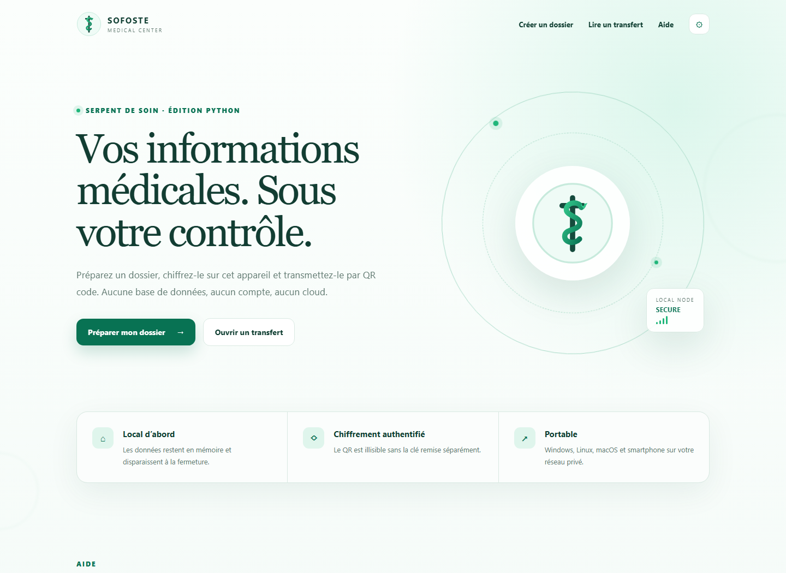

<div align="center">
  
  <h1>Sofoste Medical Center</h1>
  <p><strong>Python Edition · Serpent of Care</strong></p>
  <p>A local-first tool for transferring a small medical record through an encrypted QR code.</p>
  <p><a href="https://github.com/sofoste93/sofostemedicalcenter.github.io/releases/latest">Download</a> · <a href="#quick-start">Quick start</a> · <a href="#learning-tour">Learning tour</a> · <a href="SECURITY.md">Security</a></p>
</div>



## What changed in version 2

The original university prototype wrote one global encrypted file to disk and then placed both the readable medical data and its encryption key in the same QR code. Version 2 rebuilds that flow:

- AES-256-GCM authenticates and encrypts the record; Scrypt derives the key.
- The QR contains only the encrypted packet. A separate 80-bit transfer key unlocks it.
- Medical data is processed in memory and is not saved by the application.
- The server binds to this computer only unless LAN mode is explicitly enabled.
- French, English and German are included, with accessible display settings.
- Native bundles include Python for Windows, Linux and macOS.

> **Scope:** this is an educational demonstrator, not a certified medical device or a replacement for a clinical information system. LAN mode uses plain HTTP; use it only on a private, trusted network.

## Quick start

Download the archive for your system from the [latest release](https://github.com/sofoste93/sofostemedicalcenter.github.io/releases/latest), extract it, and launch the executable:

| System | Download | File to run after extraction |
| --- | --- | --- |
| Windows x64 | `Sofoste-Medical-Center-Windows-x64.zip` | `Sofoste-Medical-Center-Windows-x64.exe` |
| Linux x64 | `Sofoste-Medical-Center-Linux-x64.tar.gz` | `Sofoste-Medical-Center-Linux-x64` |
| macOS Intel | `Sofoste-Medical-Center-macOS-x64.tar.gz` | `Sofoste-Medical-Center-macOS-x64` |
| macOS Apple Silicon | `Sofoste-Medical-Center-macOS-arm64.tar.gz` | `Sofoste-Medical-Center-macOS-arm64` |

The browser opens at `http://127.0.0.1:8765`. No Python or Java installation is required.

To open the app on a phone connected to the same trusted Wi-Fi:

```text
Sofoste-Medical-Center-Windows-x64.exe --lan
```

The terminal prints the address to open on the phone. Allow the app through the firewall only for private networks. Use `--no-browser`, `--port 9000`, or `--version` when needed.

## Source installation

Python 3.11 or newer is required.

```bash
python -m venv .venv
# Windows: .venv\Scripts\activate
# Linux/macOS: source .venv/bin/activate
python -m pip install -e ".[dev]"
python -m sofoste_medical_center
```

Run the checks with:

```bash
ruff check .
pytest --cov=sofoste_medical_center
```

## Learning tour

The code is split by responsibility so learners can follow one idea at a time:

1. `validation.py` accepts only known fields and enforces small limits.
2. `crypto.py` compresses JSON, derives a key with Scrypt, then encrypts it with AES-GCM.
3. `web.py` handles pages, CSRF checks, security headers and QR creation.
4. `cli.py` starts Waitress locally and enables LAN access only with `--lan`.
5. `tests/` demonstrates round trips, tamper rejection, validation and HTTP protections.

The QR URL stores its packet after `#packet=`. URL fragments stay in the browser and are not sent in the initial HTTP request. JavaScript moves the packet into the receive form and immediately clears the address bar.

## Privacy model

The app has no database, analytics, telemetry or external web assets. It does not write the form, packet or QR image to disk. Closing the result page removes the displayed record; stopping the process clears its in-memory state. Browser history and clipboard behavior still depend on the browser and operating system, so close the pages and clear the clipboard after a real transfer.

See [SECURITY.md](SECURITY.md) for limitations and responsible reporting.

## License

[MIT](LICENSE) © Sofoste contributors.
